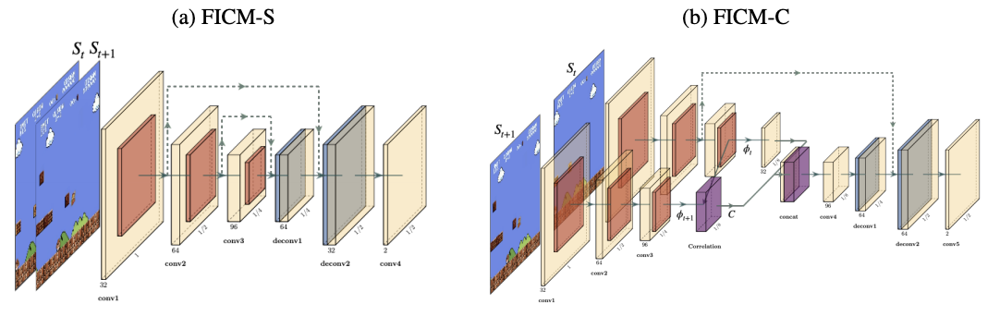

#### Status: Code is coming soon.
## Exploration via flow-based intrinsic rewards
<center>
</img>
</center>

This is a TensorFlow based implementation for our paper on [exploration via flow-based intrinsic reward (Coming soon, we'll have a poster in ICLR 2019 TARL workshop)]().

Flow-based intrinsic module (FICM) is used for evaluating the novelty of observations. FICM generates intrinsic rewards based on the prediction errors of optical flow estimation since the rapid change part in consecutive frames usually serve as important signals. 

Without any external reward, FICM can help RL agent to play SuperMario successfully. 

</img></img>

This repo is inherited from [large-scale-curiosity](https://github.com/openai/large-scale-curiosity), and we also borrowed `correlation layer` from [flownet2_tf](https://github.com/sampepose/flownet2-tf).

### Dependencies
* Python3.5

### Installation
```bash
pip install -r requirement.txt
pip install git+https://github.com/openai/baselines.git@3301089b48c42b87b396e246ea3f56fa4bfc9678
```

#### FICM-C (Optional)
If you want to use FICM-C architecture, you'll need to compile for correlation layer additionally.
```bash
cd correlation_layer
make all
```
> Note: You might encounter some errors raised from the source codes of tensorflow, you can easily change the header file of
'cuda_kernel_helper.h', 'cuda_device_functions.h', and 'cuda_launch_config.h'

#### SuperMario (Optional)
If you want to train an agent to play SuperMario, you need to install `retro` and import `SuperMarioBros-Nes` game.

```bash
pip install retro
```

Read the official guide [here](https://retro.readthedocs.io/en/latest/getting_started.html#importing-roms)

### Example usage
#### Mario
```bash
python run.py --feat_learning flowS --env_kind mario
```
#### Atari
```bash
python run.py --feat_learning flowS --env SeaquestNoFrameskip-v4 --seed 666
```

### R
    @inproceedings{largeScaleCuriosity2018,
        Author = {Burda, Yuri and Edwards, Harri and
                  Pathak, Deepak and Storkey, Amos and
                  Darrell, Trevor and Efros, Alexei A.},
        Title = {Large-Scale Study of Curiosity-Driven Learning},
        Booktitle = {arXiv:1808.04355},
        Year = {2018}
    }
