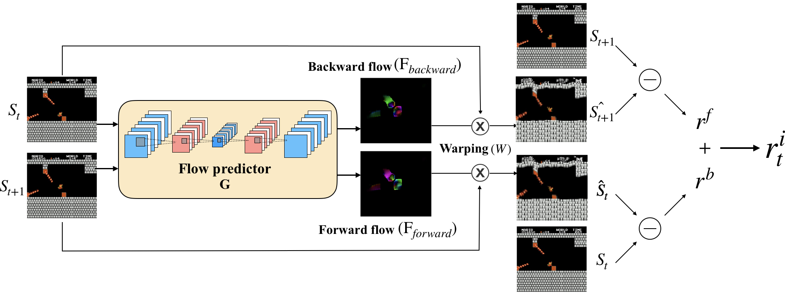

#### Status: Archive.
## Flow-based Intrinsic Curiosity Module (FICM)
<center>
</img>
</center>

### [[Paper]](https://www.ijcai.org/Proceedings/2020/286) [[Demo Video]](https://www.youtube.com/watch?v=w-a6akKpWT0&feature=youtu.be) [[Reddit Discuss]](https://www.reddit.com/r/MachineLearning/comments/bu05ua/p_playing_supermario_bros_without_knowing_any/)

This is a TensorFlow-based implementation for our paper "Flow-based Intrinsic Curiosity Module".

FICM is used for evaluating the novelty of observations, it generates intrinsic rewards based on the prediction errors of optical flow estimation since the rapid change part in consecutive frames usually serve as important signals. 

Without any external reward, FICM can help RL agent to play SuperMario successfully. 

</img></img>


This repo is largely inherited from [large-scale-curiosity](https://github.com/openai/large-scale-curiosity), and we also borrowed `correlation layer` from [flownet2_tf](https://github.com/sampepose/flownet2-tf).

-----

[Flow-based Intrinsic Curiosity Module](https://www.ijcai.org/Proceedings/2020/286)  
[Hsuan-Kung Yang*](https://hellochick.github.io/), Po-Han Chiang*, Min-Fong Hong, and Chun-Yi Lee (* equal contributions)  
ElsaLab, National Tsing Hua University  
In [IJCAI'20 main track](https://ijcai20.org/) and [ICLR'19 TARL workshop](https://tarl2019.github.io/)


### Dependencies
* Python3.5

### Installation
```bash
pip install -r requirement.txt
pip install git+https://github.com/openai/baselines.git@3301089b48c42b87b396e246ea3f56fa4bfc9678
```

#### FICM-C (Optional)
If you want to use FICM-C architecture, you'll need to compile for correlation layer additionally.
```bash
cd correlation_layer
make all
```
> Note: You might encounter some errors raised from the source codes of tensorflow, you can easily change the header file of
'cuda_kernel_helper.h', 'cuda_device_functions.h', and 'cuda_launch_config.h'

#### SuperMario (Optional)
If you want to train an agent to play SuperMario, you need to install `retro` and import `SuperMarioBros-Nes` game.

```bash
pip install retro
```

Read the official guide [here](https://retro.readthedocs.io/en/latest/getting_started.html#importing-roms)

### Example usage
#### Mario
```bash
python run.py --feat_learning flowS --env_kind mario
```
#### Atari
```bash
python run.py --feat_learning flowS --env SeaquestNoFrameskip-v4 --seed 666
```

### Citation
If you find this paper or code implementation helpful, please consider to cite:

```
@inproceedings{flowbasedcuriosity2020,
  title     = {Flow-based Intrinsic Curiosity Module},
  author    = {Hsuan-Kung Yang, Po-Han Chiang, Min-Fong Hong and Chun-Yi Lee},
  booktitle = {Proceedings of the Twenty-Ninth International Joint Conference on
               Artificial Intelligence, {IJCAI-20}},
  publisher = {International Joint Conferences on Artificial Intelligence Organization},             
  editor    = {Christian Bessiere}	
  pages     = {2065--2072},
  year      = {2020},
  month     = {7},
  note      = {Main track}
  doi       = {10.24963/ijcai.2020/286},
  url       = {https://doi.org/10.24963/ijcai.2020/286},
}

```

### Reference
    @inproceedings{largeScaleCuriosity2018,
        Author = {Burda, Yuri and Edwards, Harri and
                  Pathak, Deepak and Storkey, Amos and
                  Darrell, Trevor and Efros, Alexei A.},
        Title = {Large-Scale Study of Curiosity-Driven Learning},
        Booktitle = {arXiv:1808.04355},
        Year = {2018}
    }
